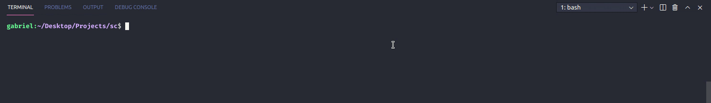

<h2 align="center">
    
</h2>

<h2 align="center">
    Code Challenge
</h2>

---

### :information_source: How To Run

###### :grey_exclamation: Before anything, please run:

- `git clone https://github.com/gabrielbahniuk/sc.git` to download the project.
- `cd scalable-capital-ts` to be in the right directory.
- `npm install` to install required dependencies.
#### Start Server
```bash
npm run server
```
###### :grey_exclamation: It is recommended to run the server in a separated window:

<h2 align="center">
    
</h2>

#### Run Tests
##### Enzyme

```bash
npm run test
```
##### Cypress

```bash
# Run tests with UI
npm run cypress:open
```

```bash
# Run tests in background
npm run cypress:run
```
#### Run Application (Dev Mode)

```bash
npm run dev
```
#### Build

```bash
npm run build
```